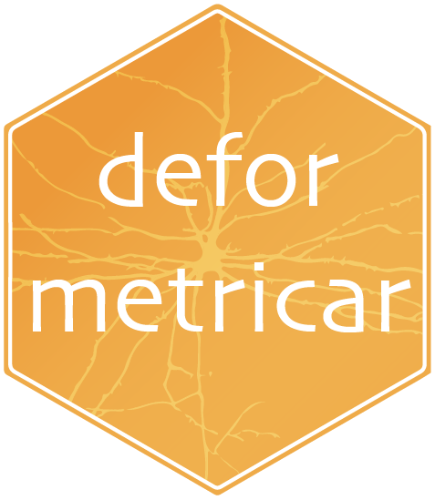
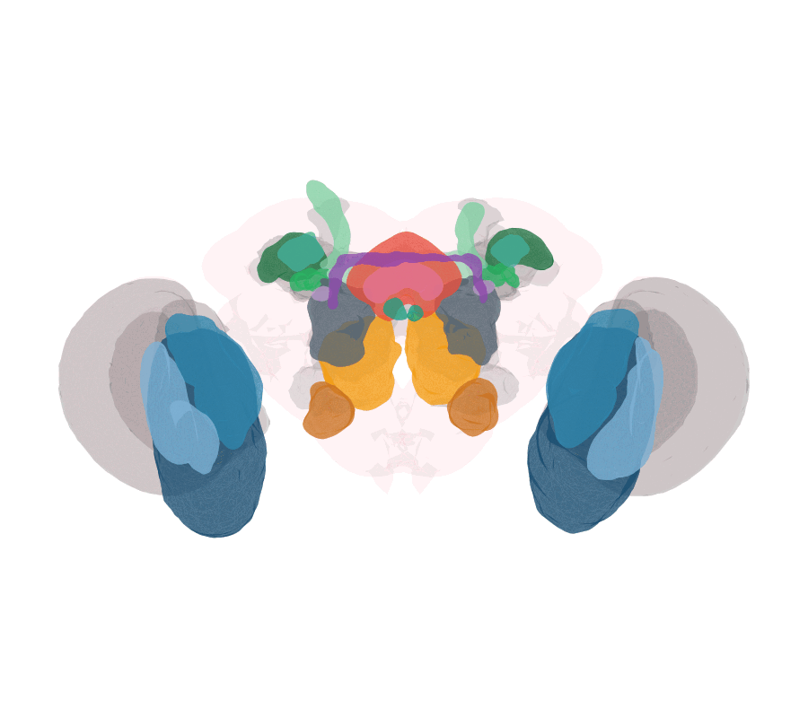
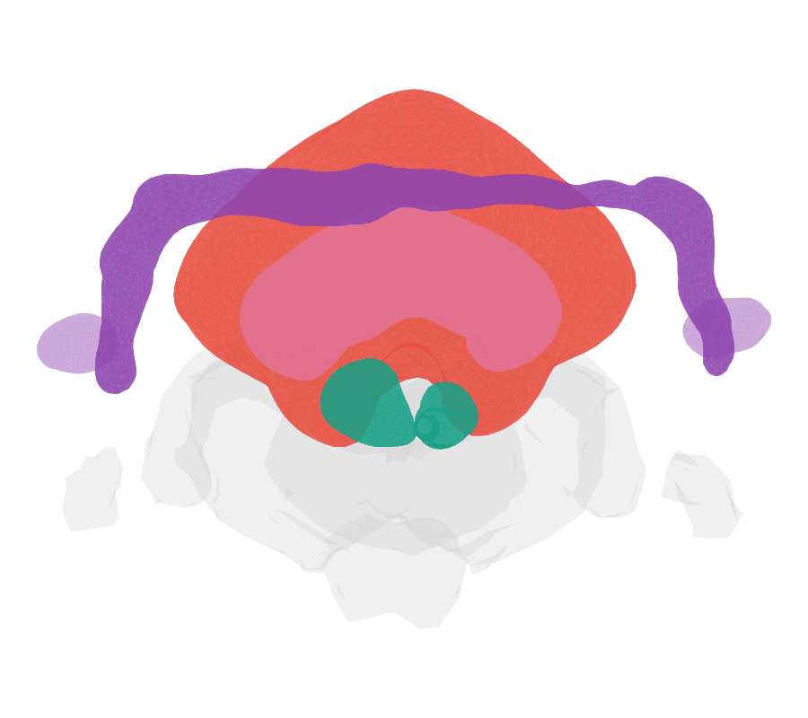

<!-- badges: start -->
[](https://natverse.github.io)
[](https://alexanderbates.github.io/deformetricar/reference/)
[](https://github.com/alexanderbates/deformetricar/actions/workflows/R-CMD-check.yaml)
[](https://lifecycle.r-lib.org/articles/stages.html#experimental)
<!-- badges: end -->

# deformetricar 

**deformetricar** is an R client for the [Deformetrica](https://www.deformetrica.org)
shape-registration toolkit (`>= 4.3`). It lets you **fit** diffeomorphisms between
3D shapes — point clouds, neuron backbones and surface meshes — and **apply** them
(geodesic shooting) to arbitrary objects, with sensible defaults for registering
fly connectome neurons. It also reads and writes VTK object formats.

Deformetrica 4 replaced the old `ShootAndFlow3` C++ binaries with a single
`deformetrica` CLI (`estimate` / `compute`); `deformetricar` wraps that modern
interface.

<p align="center">


</p>

*Left: the whole **Aedes aegypti** brain surface warped onto the **Drosophila**
JRC2018F template. Right: just the central complex — the mosquito's CBU/CBL onto the
fly's fan-shaped and ellipsoid bodies. Both are produced end-to-end by the
[mosquito-to-fly vignette](https://alexanderbates.github.io/deformetricar/articles/mosquito-to-fly.html).*

## Installation

```r
# install.packages("remotes")
remotes::install_github("alexanderbates/deformetricar")
```

### Installing Deformetrica

`deformetricar` shells out to the [Deformetrica (>= 4.3)](https://gitlab.com/icm-institute/aramislab/deformetrica)
command-line tool, so you need that available once. The smooth path is to let the
package set it up in a managed Python environment (uses
[reticulate](https://rstudio.github.io/reticulate/) + conda):

```r
# one-time; pulls torch/vtk into a dedicated "deformetrica" conda env
deformetricar::install_deformetrica()
```

After that `find_deformetrica()` resolves the executable automatically. It searches,
in order: `options(deformetricar.exe=)`, the `PATH`, the managed environment above,
then `~/.conda/envs/deformetrica/`. If you already have Deformetrica elsewhere, just
point at it with `options(deformetricar.exe = "/path/to/deformetrica")`.

> **Apple Silicon (arm64 macOS):** Deformetrica 4.3 pins `torch==1.6`, which has no
> native arm64 wheels. `install_deformetrica()` handles this automatically — on an
> M-series Mac it builds an `osx-64` conda env (Python 3.8) that runs under Rosetta
> and pulls the x86-64 wheels (verified end-to-end here). You just need Rosetta
> (`softwareupdate --install-rosetta`) and a conda binary. Linux and Intel macOS
> install natively. See `?install_deformetrica`.

## Quick start

```r
library(deformetricar)

# Fit a diffeomorphism between two corresponding point sets ...
fit <- deformetrica_register(source, target, kernel_width = 20)

# ... then apply it to any object (returns the same class you pass in)
warped <- deformetrica_shoot(new_points, fit$control_points, fit$momenta,
                             kernel_width = fit$kernel_width)

# Register a whole SET of matched objects at once (e.g. cognate neuron tracts)
fit <- deformetrica_register_multi(sources, targets, kernel_width = 20,
                                   landmarks = list(source = lm_s, target = lm_t))
```

## Articles

- **[Warping a mosquito brain onto the fly](https://alexanderbates.github.io/deformetricar/articles/mosquito-to-fly.html)** —
  register the *Aedes aegypti* brain onto *Drosophila* JRC2018F, driven by cross-identified
  neuropils matched left-to-left and right-to-right, with a nat.ggplot GIF.
- **[A FAFB left-right brain registration](https://alexanderbates.github.io/deformetricar/articles/fafb-left-right.html)** —
  register the FAFB brain surface to its mirror image.
- **[Symmetrising the L1 larval CNS + finding cognates](https://alexanderbates.github.io/deformetricar/articles/l1-symmetrise-cognates.html)** —
  build a left-right symmetrising warp from L1 larval VFB CATMAID neurons and find cognate pairs.

## Citation

`citation("deformetricar")` cites the package, the
[natverse](https://doi.org/10.7554/eLife.53350) (Bates et al. 2020, *eLife*), and
the Deformetrica software (Bône et al. 2018; Durrleman et al. 2014). Please cite
all three when you use `deformetricar`.

## Acknowledgements

Deformetrica is developed by the [Aramis Lab](https://www.deformetrica.org) at the
Paris Brain Institute (ICM). `deformetricar` merely wraps it. Part of the
[natverse](https://natverse.github.io).
