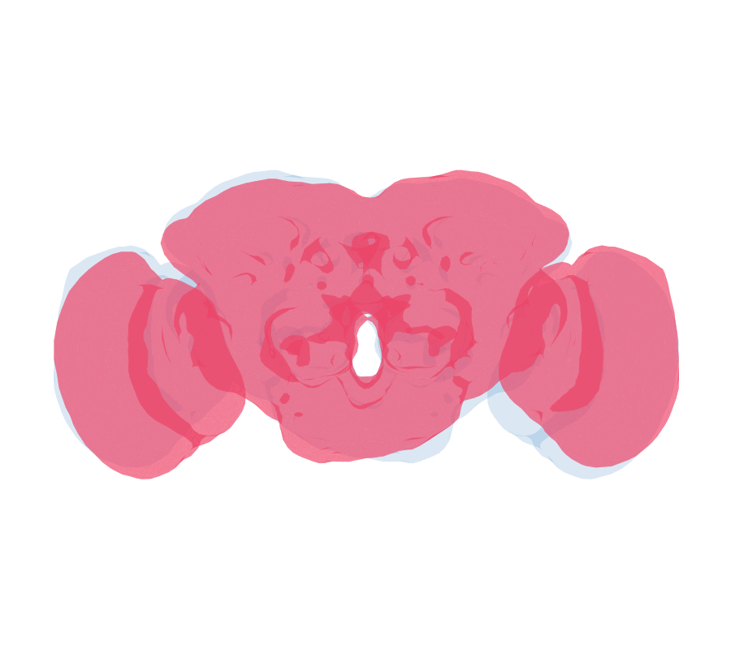

```{r, include = FALSE}
knitr::opts_chunk$set(collapse = TRUE, comment = "#>", eval = FALSE)
# Deformetrica (>= 4.3) + a GPU are needed for the fit/shoot chunks (eval=FALSE).
```

## Goal

Build a **left-right (L-R) bridging registration** of the fly brain: a
diffeomorphism that maps one hemisphere onto the mirror image of the other, so a
neuron on the left can be compared directly with its cognate on the right. This
is the modern, package-native re-implementation of the recipe in
[flyconnectome/deformetricaLR](https://github.com/flyconnectome/deformetricaLR),
which fit one diffeomorphism to a **set of matched cognate neuron tracts** (each a
`NonOrientedPolyLine`), optionally anchored by neuropil **landmarks**.

The result — the flipped right projection-neuron tracts flowing onto their left
cognates under the fitted diffeomorphism:



The pipeline is three stages, following that repo and the package's `deform/`
scripts:

1. **Mirror** the right-side neurons to the left (reflect across the midline).
2. **Affine** initialise (Morpho) so the flipped tracts roughly overlie their
   left cognates (a *similarity* transform from cognate centroids — stable from few
   correspondences, where a full 12-DOF affine would shear the tracts apart).
3. **Deformable** multi-object Deformetrica fit over all matched pairs at once,
   with a neuropil landmark object as a global regulariser.

```{r setup}
library(deformetricar)
library(nat)
library(nat.flybrains)         # FCWB template + mirroring
library(nat.templatebrains)    # mirror_brain
library(Morpho)
```

## 1. Matched cognate neurons, mirrored to one side

`nat::Cell07PNs` are 40 projection neurons in FCWB space with a `Glomerulus`
label — an ideal small, self-contained set of *typed* neurons whose left/right
cognates are the same glomerulus. We take the right cell of each glomerulus as
the moving template and its left cognate as the fixed target, and flip the right
cells to the left hemisphere first.

```{r matched}
pn <- Cell07PNs
nm <- names(pn)
side <- toupper(substr(nm, nchar(nm), nchar(nm)))   # side is the neuron name's last char (R/L)
glom <- attr(pn, "df")$Glomerulus
gloms <- intersect(unique(glom[side == "R"]), unique(glom[side == "L"]))  # DA1, DL3, DP1m, VA1d
r_glom <- glom[side == "R"]; l_glom <- glom[side == "L"]
right_nl <- pn[side == "R"]; left_nl <- pn[side == "L"]
right <- setNames(lapply(gloms, function(g) right_nl[[which(r_glom == g)[1]]]), gloms)
tgt   <- setNames(lapply(gloms, function(g) left_nl[[which(l_glom == g)[1]]]), gloms)
```

## 2. Reflection + affine initialisation (Morpho)

Reflect the right tracts across the template midline, then a *similarity* transform
(rotation + uniform scale + translation, from the cognate centroids) refines the
overlap. We reflect explicitly rather than fit a full affine: from only four
centroid correspondences a 12-DOF affine is exactly determined and shears the
tracts apart, whereas the 7-DOF similarity is stable.

```{r affine}
allm <- do.call(rbind, c(lapply(right, nat::xyzmatrix), lapply(tgt, nat::xyzmatrix)))
midX <- mean(range(allm[, 1]))
reflectX <- function(n) { m <- nat::xyzmatrix(n); m[, 1] <- 2 * midX - m[, 1]; nat::xyzmatrix(n) <- m; n }
right_ref <- lapply(right, reflectX)
c_src <- t(sapply(right_ref, function(n) colMeans(nat::xyzmatrix(n))))
c_tgt <- t(sapply(tgt, function(n) colMeans(nat::xyzmatrix(n))))
aff <- Morpho::computeTransform(c_tgt, c_src, type = "similarity")
src_aff <- lapply(right_ref, function(n) { nat::xyzmatrix(n) <- Morpho::applyTransform(nat::xyzmatrix(n), aff); n })
src_aff <- lapply(src_aff, nat::resample, stepsize = 4)   # thin the tracts for a tractable fit
tgt_rs  <- lapply(tgt, nat::resample, stepsize = 4)
c_src_aff <- Morpho::applyTransform(c_src, aff)
```

## 3. Multi-object Deformetrica L-R fit (tracts + landmark anchor)

One diffeomorphism over ALL matched tracts at once (`PolyLine` + `Varifold`),
regularised by a shared neuropil-centroid **landmark** object — the
`inc_tracts_lmarks` variant from deformetricaLR. Contrast with a landmark-free fit
(`inc_tracts_no_landmark`) by dropping the `landmarks` argument. The kernel width is
set from the combined bounding box so the control-point grid stays bounded.

```{r fit}
fit <- deformetrica_register_multi(
  sources = src_aff, targets = tgt_rs,
  kernel_width = 13,                       # ~1/12 of the tract bounding box (microns)
  landmarks = list(source = c_src_aff, target = c_tgt),
  data_sigma = 2.0, max_iterations = 100, device = "cuda", verbose = TRUE)
```

## 4. Apply + GIF of the L-R flow

Warp the full flipped-right neuron set through the fitted L-R diffeomorphism, and
turn the geodesic-flow timepoints into a GIF.

```{r apply-gif}
right_LR <- lapply(src_aff, function(n)
  deformetrica_shoot(n, fit$control_points, fit$momenta, kernel_width = fit$kernel_width))

frames <- sort(Sys.glob(file.path(fit$output_dir, "*GeodesicFlow*tp_*.vtk")))
render <- function(vtk, png) {
  m <- read.vtk(vtk, item = "points")
  rgl::open3d(useNULL = TRUE)
  rgl::points3d(nat::xyzmatrix(do.call(c, tgt)), col = "grey70", size = 1)   # left targets
  rgl::points3d(m, col = "firebrick", size = 2)                              # flowing right
  rgl::snapshot3d(png, webshot = FALSE); rgl::close3d()
}
pngs <- vapply(seq_along(frames), function(i) { p <- sprintf("lr_%02d.png", i); render(frames[i], p); p }, "")
# gifski::gifski(pngs, "fafb_left_right.gif", delay = 0.15)
```

## 5. Validation — does the L-R warp improve cognate correspondence?

The registration is good if a flipped-and-warped right neuron matches its left
cognate better than the affine-only flip does. We score with NBLAST (higher =
better) over the held-out glomeruli, comparing affine-only vs warped.

```{r validation}
library(nat.nblast)
dp <- function(n) nat::dotprops(n / 1, k = 5)
mrr <- function(query_set, target_set) {
  s <- nat.nblast::nblast_allbyall(c(query_set, target_set))  # illustrative; use held-out split
  mean(diag(s[names(query_set), names(target_set)]))
}
affine_score <- mrr(lapply(src_aff, dp), lapply(tgt, dp))
warp_score   <- mrr(lapply(right_LR, dp), lapply(tgt, dp))
c(affine = affine_score, warp = warp_score)   # warp should exceed affine
```

**Acceptance criteria (iterate `kernel_width` / `data_sigma` against these):** the
warped cognate NBLAST beats the affine-only baseline on held-out glomeruli, and
L-R type consistency (assign each warped right neuron to its nearest left cognate)
rises. If a single whole-brain L-R warp cannot achieve this, register per-region
(e.g. antennal-lobe glomeruli separately), exactly the neuropil-pair fallback used
in the mosquito vignette.
