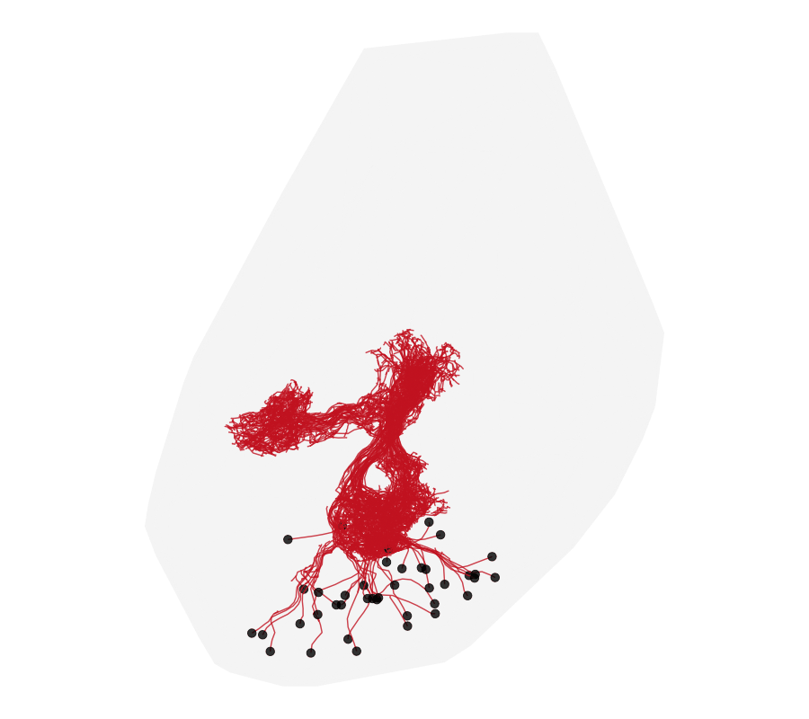

```{r, include = FALSE}
knitr::opts_chunk$set(collapse = TRUE, comment = "#>", eval = FALSE, purl = FALSE)
# Needs a live CATMAID/VFB connection and a Deformetrica (>= 4.3) install, so the
# chunks are eval=FALSE. They run locally end-to-end.
```

## Goal

The **L1 larval connectome** — the first-instar *Drosophila* larval CNS, manually
reconstructed and hosted openly by [Virtual Fly Brain](https://www.virtualflybrain.org/)
— is very nearly bilaterally symmetric. This vignette builds a **left-right
symmetrising diffeomorphism** for the *whole* L1 CNS (brain **and** ventral nerve
cord) from its matched left/right neuropil compartments, uses it to carry structures
across the midline onto their contralateral partners, and then **finds cognate neuron
pairs** by morphological similarity (NBLAST) once the two sides are in register.

Ten years ago this package shipped three hard-wired, L1-only helpers —
`apply.mirror.affine()`, `symmetrisel1()` and `otherside()` — backed by a bundled
transform. `deformetricar` is no longer L1-specific, so those functions are gone
from the package. **This vignette rebuilds them from scratch**, as a few lines each
over the general `deformetricar` API, driven by the live VFB dataset. That is the
point of the walkthrough: the three functions are the deliverable.



```{r setup}
library(deformetricar)
library(nat)
library(catmaid)          # aka rcatmaid
library(Rvcg)             # mesh clean / decimate
library(Morpho)           # applyTransform
```

## 1. Fetch the L1 CNS and its left/right compartments (CATMAID)

The L1 larval CATMAID is public and read-only. It ships the whole-CNS surface
(`cns`) plus a set of bilateral neuropil **volumes** — the two brain hemispheres,
the SEZ, and the thoracic/abdominal VNC segments (`T1`–`T3`, `A1`–`A8`) — each as a
`_left`/`_right` pair. Those matched pairs are the anchors that teach the warp what
"symmetric" means; we take a spread of them down the whole length of the CNS.

```{r fetch}
l1 <- catmaid_connection(server = "https://l1em.catmaid.virtualflybrain.org/")
vl <- catmaid_get_volumelist(conn = l1)
# Deformetrica needs ~O(1-100) coordinates: work in um, not the raw nm.
nm2um  <- function(x) { xyzmatrix(x) <- xyzmatrix(x) / 1000; x }
getvol <- function(name) nm2um(Rvcg::vcgClean(
  as.mesh3d(catmaid_get_volume(vl$id[vl$name == name], conn = l1, rval = "mesh3d")),
  sel = 0, silent = TRUE))

cns   <- getvol("cns")                                    # the whole CNS surface
pairs <- c("Brain Hemisphere", "SEZ", "T1", "T2", "A3", "A6")   # head -> tail spread
lname <- function(p) if (p == "Brain Hemisphere") "Brain Hemisphere left"  else paste0(p, "_left")
rname <- function(p) if (p == "Brain Hemisphere") "Brain Hemisphere right" else paste0(p, "_right")
L <- setNames(lapply(pairs, function(p) getvol(lname(p))), pairs)
R <- setNames(lapply(pairs, function(p) getvol(rname(p))), pairs)
```

## 2. `apply.mirror.affine()` — reflect one side onto the other

The linear half of a symmetrising map. Reflect an object across the CNS midline
plane (so left ↔ right), then rigidly affine-align that reflection back onto the
original CNS — this removes the fact that the specimen's midline is neither exactly
at `x = 0` nor exactly axis-aligned. Everything downstream rides this **same**
transform, so we fit it once (from the whole CNS) and wrap it as a function.

```{r mirror-affine}
midX   <- mean(range(xyzmatrix(cns)[, 1]))                # specimen midline (x)
mirror <- function(m) {                                   # reflect across x = midX
  xyzmatrix(m)[, 1] <- 2 * midX - xyzmatrix(m)[, 1]
  if (!is.null(m$it)) m$it <- m$it[c(2, 1, 3), ]          # keep surface winding outward
  m$normals <- NULL; m
}
pre <- affine_prealign(mirror(cns), cns, type = "rigid")  # reflection -> original CNS

# apply.mirror.affine(x): reflect x, then apply that same rigid alignment.
apply.mirror.affine <- function(x) pre$apply(mirror(x))
```

## 3. Fit the symmetrising diffeomorphism from the matched compartments

The affine cannot capture the specimen's *non-rigid* left-right asymmetry (a slightly
bent VNC, one hemisphere fuller than the other). A diffeomorphism can. We fit **one**
diffeomorphism to the whole set of matched compartments at once with
`deformetrica_register_multi()`, in **both directions** so the result is genuinely
symmetric: each mirror-affined *right* compartment is driven onto its *left* partner,
and each mirror-affined *left* onto its *right*. Registering the compartment
*surfaces* (not the ~thousands of neurons) is what keeps this cheap and robust.

```{r fit}
dec  <- function(m, n = 700L) Rvcg::vcgQEdecim(m, tarface = n)
srcs <- tgts <- list()
for (p in pairs) {
  srcs[[paste0(p, "_R")]] <- dec(apply.mirror.affine(R[[p]])); tgts[[paste0(p, "_R")]] <- dec(L[[p]])
  srcs[[paste0(p, "_L")]] <- dec(apply.mirror.affine(L[[p]])); tgts[[paste0(p, "_L")]] <- dec(R[[p]])
}
kw  <- sqrt(sum((apply(xyzmatrix(cns), 2, max) - apply(xyzmatrix(cns), 2, min))^2)) / 12
fit <- deformetrica_register_multi(srcs, tgts, kernel_width = kw, data_sigma = 3,
                                   timepoints = 15L, max_iterations = 40L, device = "auto")
```

## 4. `symmetrisel1()` and `otherside()` — the full contralateral map

Now compose the two halves. `symmetrisel1()` mirror-affines an object and then flows
it through the fitted diffeomorphism — the complete non-linear symmetrisation. Because
the diffeomorphism that makes the CNS symmetric is *exactly* the map that carries each
structure onto its contralateral partner, `otherside()` — "send this neuron to the
other side of the CNS" — is the very same function. (`flow = TRUE` keeps every geodesic
timepoint, for the animation; the default returns just the endpoint.)

```{r symmetrise-fns}
symmetrisel1 <- function(x, flow = FALSE)
  deformetrica_shoot(apply.mirror.affine(x), fit$control_points, fit$momenta,
                     kernel_width = fit$kernel_width, flow = flow)

otherside <- symmetrisel1        # the symmetrising map IS the left<->right map
```

These three functions — `apply.mirror.affine()`, `symmetrisel1()`, `otherside()` —
are the modern, dataset-driven replacements for the old bundled helpers. They accept
anything with `xyzmatrix()` coordinates: a points matrix, a `mesh3d`, a `neuron` or a
`neuronlist`.

## 5. Watch the map carry the right cells onto their left cognates

The whole L1 CNS is so nearly symmetric that the *surface* deformation is only a few µm
— true to the biology, but too subtle to watch. The striking thing to see is the **map
applied to cells**: send the right Kenyon cells across the midline with `otherside()` and
watch them land on their left partners. We animate the full journey in two acts — the
**mirror-affine** reflection (a big, ~50 µm cross-midline sweep) and then the
**diffeomorphic** flow — over a static grey CNS, viewed along its **long axis** (first
principal component, head-to-tail) so the bilateral symmetry is edge-on. The left Kenyon
cells (blue) are drawn static as the target the right ones (rose) should meet.

```{r animate}
getkc <- function(ann) {
  n <- read.neurons.catmaid(catmaid_skids(ann, conn = l1), conn = l1)
  n <- nat::nlapply(nat::nlapply(n, nat::resample, stepsize = 1500), nm2um)
  if (length(n) > 36) n[round(seq(1, length(n), length.out = 36))] else n   # a legible subset
}
kcR <- getkc("annotation:Kenyon Cell right")
kcL <- getkc("annotation:Kenyon Cell left")

# the two acts of otherside(): the mirror-affine sweep, then the diffeomorphic flow
interp  <- function(o, from, to, n) lapply(seq(0, 1, length.out = n),
             function(a) { x <- o; xyzmatrix(x) <- (1 - a) * from + a * to; x })
aff_kc  <- apply.mirror.affine(kcR)                                    # reflect + rigid
act1    <- interp(kcR, xyzmatrix(kcR), xyzmatrix(aff_kc), 12)          # the cross-midline sweep
act2    <- deformetrica_shoot(aff_kc, fit$control_points, fit$momenta,
                              kernel_width = fit$kernel_width, flow = TRUE)   # the diffeomorphism
flow_kc <- c(act1, act2)

# view: long axis (PC1) vertical, next axis horizontal, shortest into the screen
pc <- prcomp(xyzmatrix(cns))$rotation
RM <- diag(4); RM[1, 1:3] <- pc[, 2]; RM[2, 1:3] <- -pc[, 1]; RM[3, 1:3] <- pc[, 3]
ggplot_flow_gif(list(KC_right = flow_kc),
                cols = list(KC_right = "#FF5C8A"), alpha = c(KC_right = 0.5),
                targets = list(KC_left = kcL), target_cols = c(KC_left = "#2C7FB8"),
                target_alpha = 0.35,
                volume = cns, volume_col = "grey65", volume_alpha = 0.10,
                rotation_matrix = RM, delay = 0.12,
                file = "l1_symmetrise.gif")   # static grey CNS + left KCs as context
```

## 6. Find left/right cognates by NBLAST

With a symmetrising map in hand, cognate-finding is direct: send every right neuron to
the other side with `otherside()`, then NBLAST it against the left neurons — the top hit
is its putative left cognate. Kenyon cells are a clean test case: they exist in matched
numbers on both sides, so most rights should map cleanly onto a left.

```{r cognates}
library(nat.nblast)
# the FULL Kenyon-cell sets (the animation above used a legible subset)
allkc <- function(ann) nat::nlapply(nat::nlapply(
  read.neurons.catmaid(catmaid_skids(ann, conn = l1), conn = l1), nat::resample, stepsize = 1000), nm2um)
KCR <- allkc("annotation:Kenyon Cell right")
KCL <- allkc("annotation:Kenyon Cell left")

kcR_other <- otherside(KCR)                              # every right KC, warped onto the left
dp <- function(nl) nat::dotprops(nl, resample = 1, k = 5, .progress = "none")
scores  <- nat.nblast::nblast(dp(kcR_other), dp(KCL), normalised = TRUE)
cognate <- apply(scores, 2, function(s) rownames(scores)[which.max(s)])
head(data.frame(left = colnames(scores), right_cognate = cognate))
```

Compare `nblast(dp(apply.mirror.affine(KCR)), dp(KCL))` (mirror-affine only) with the
symmetrised scores: the diffeomorphism should raise the correct-cognate NBLAST and
sharpen the top-1 margin, making hemilineage- and cell-type-level left-right mapping
clearer.

## Notes

- **Why compartments, not neurons, drive the fit.** Registering a handful of decimated
  compartment *surfaces* is cheap and numerically stable; fitting to thousands of
  neuron skeletons at once is neither. The neurons are what we *apply* the finished
  map to — that is always cheap (`deformetrica_shoot()`).
- **The three functions are the point.** `apply.mirror.affine()`, `symmetrisel1()` and
  `otherside()` are just closures over `pre` and `fit`. Swap the dataset (or the
  compartment list) and you have a symmetriser for any other nervous system — nothing
  here is L1-specific any more, which is exactly why they no longer live in the package.
- **More anchors, better VNC.** Add more of the `A1`–`A8` / `T1`–`T3` pairs to `pairs`
  for a tighter fit along the nerve cord, at the cost of a slower registration.

## See also

The whole-brain and neuropil surface analogues of this workflow are in the
[mosquito-to-fly](mosquito-to-fly.html) and [FAFB left-right](fafb-left-right.html)
vignettes.
