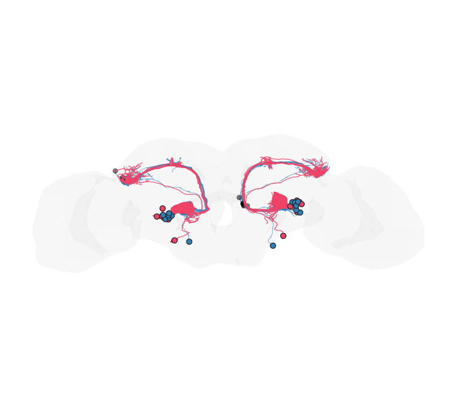

```{r, include = FALSE}
knitr::opts_chunk$set(collapse = TRUE, comment = "#>", eval = FALSE, purl = FALSE)
# The data-pull and Deformetrica chunks need neuPrint/CAVE access tokens and a
# working Deformetrica (>= 4.3) install, so they are eval = FALSE on CI. They run
# end-to-end locally on a CPU once tokens and Deformetrica are set up (see setup).
```

## Goal

Take a cell type reconstructed in **two different adult *Drosophila* connectomes** —
the isolated-CNS EM volume **maleCNS** and the whole central-nervous-system
**BANC** — and warp one onto the other so the same neurons can be compared in a
single coordinate frame. We use the **DA1 antennal-lobe projection neurons**
(`DA1_lPN` + `DA1_vPN`), a small, well-defined, bilaterally paired population.



The registration is driven by the neurons' own shape, matched **per cell type and
side**, and anchored at the cell bodies:

1. a **template bridge** maleCNS → FAFB14 → JRC2018F → BANC lands the maleCNS
   neurons on top of the BANC ones to within a few microns;
2. each neuron is **rooted at its soma** and reduced to a simplified **core frame**
   (`nat::simplify_neuron()`), and its **surface mesh** is decimated to matched
   complexity on both sides;
3. a **multi-object diffeomorphism** (`deformetrica_register_multi()`) fits, per
   (cell type, side), the core-frame skeletons (`Varifold`, weighted strongly) and
   the neuron-surface meshes (`Current`), plus an ordered **soma / root-point
   `Landmark`** correspondence and a weak whole-brain hull anchor;
4. a **nat.ggplot animation** (`ggplot_flow_gif()`) of the geodesic flow, with the
   somata shown as circles.

```{r setup}
library(deformetricar)
library(nat)
library(malecns)        # maleCNS (male-cns:v0.9) neuprint client + bridging landmarks
library(bancr)          # BANC CAVE/neuprint client + JRC2018F<->BANC bridge + surfaces
library(neuprintr)
library(nat.flybrains); library(nat.jrcbrains); library(nat.templatebrains)
library(fafbseg)
library(Rvcg); library(Morpho)   # mesh decimation / merging

# Tokens: the maleCNS and BANC data live behind neuPrint / CAVE. Follow the setup in
# the malecns, bancr and neuprintr READMEs to get your own tokens into ~/.Renviron.
#
# One-time: set up the Deformetrica CLI this package wraps, in a managed conda env.
# install_deformetrica()      # (skip if find_deformetrica() already resolves)
```

Everything runs locally on a CPU (`device = "cpu"`); `device = "auto"` uses a CUDA
GPU if present. **Work in microns** — Deformetrica needs O(1–100) coordinates, and
a fit in nm can silently collapse to an identity warp. BANC and maleCNS data come in
nm, so we divide by 1000 throughout.

## 1. Fetch both datasets: metadata, skeletons, meshes, somata

Both connectomes annotate the DA1 uniglomerular projection neurons as `DA1_lPN` and
`DA1_vPN` (we exclude the receptor neurons `ORN_DA1`). We keep each neuron's **cell
type and side**, and drop any neuron missing either — the registration matches
strictly by (type, side).

```{r fetch}
um <- function(x) { xyzmatrix(x) <- xyzmatrix(x) / 1000; x }

## --- maleCNS: metadata, skeletons, somata (all native nm) ---
mm <- mcns_neuprint_meta("DA1")
mm <- mm[mm$type %in% c("DA1_lPN", "DA1_vPN") & mm$somaSide %in% c("L", "R"), ]
mn <- nlapply(read_mcns_neurons(mm$bodyid), resample, stepsize = 1000)
# somaLocation is an "x,y,z" string in 8 nm voxels -> native nm:
msoma <- do.call(rbind, lapply(strsplit(mm$somaLocation, ","), as.numeric)) * 8

## --- BANC: metadata, L2 skeletons, somata from the nucleus table (native nm) ---
bm <- banc_meta()
bm <- bm[bm$type %in% c("DA1_lPN", "DA1_vPN") & bm$side %in% c("left", "right"), ]
bn <- nlapply(banc_read_l2skel(bm$id), resample, stepsize = 1000)
nuc   <- banc_nuclei(rootids = bm$id)                 # nucleus_position_nm (nm)
bsoma <- data.frame(xyzmatrix(nuc$nucleus_position_nm),
                    root_id = as.character(nuc$root_id))
```

Neuron **meshes** are large (hundreds of thousands of faces), so we decimate each to
a common target — the key is *matched complexity on both sides* so the `Current`
attachment compares like with like.

```{r meshes}
TARFACE <- 1000L
mme <- nlapply(read_mcns_meshes(mm$bodyid, units = "nm"), Rvcg::vcgQEdecim, tarface = TARFACE)
bme <- nlapply(banc_read_neuron_meshes(bm$id),            Rvcg::vcgQEdecim, tarface = TARFACE)
```

## 2. Bridge the maleCNS side into BANC space

maleCNS and BANC each have their own template. We hop through the shared fly
templates — the `malecns` package ships landmark bridges to **FAFB14**,
`nat.jrcbrains` carries **FAFB14 → JRC2018F**, and `bancr` inverts its own
**JRC2018F ↔ BANC** thin-plate spline — carrying the neurons, meshes and somata
through the *same* transform.

```{r bridge}
malecns:::mcns_register_xforms()      # register the bundled malecns<->FAFB14 bridges
to_banc <- function(x) {
  x <- xform_brain(x, sample = "malecns", reference = "FAFB14")
  x <- xform_brain(x, sample = "FAFB14",  reference = "JRC2018F")
  banc_to_JRC2018F(x, region = "brain", banc.units = "nm", inverse = TRUE)  # -> BANC nm
}
mn  <- um(to_banc(mn));                             bn  <- um(bn)
mme <- nlapply(mme, function(m) um(`xyzmatrix<-`(m, value = to_banc(xyzmatrix(m)))))
bme <- nlapply(bme, um)
msoma <- to_banc(msoma) / 1000                      # BANC µm
bsoma[c("X","Y","Z")] <- bsoma[c("X","Y","Z")] / 1000
```

## 3. Prepare the registration objects

**Root at the soma, then simplify to a core frame.** A soma sits at the end of a
backbone, so we first re-root each neuron there (`nat::reroot()` at the soma point),
then reduce it to its main branches with `nat::simplify_neuron()`. The core frame
aligns the neuron's skeleton without the noise of fine twigs (and is much lighter to
fit).

```{r coreframe}
msl <- setNames(asplit(msoma, 1), as.character(mm$bodyid))
bsl <- setNames(asplit(as.matrix(bsoma[c("X","Y","Z")]), 1), bsoma$root_id)
core <- function(nl, somalist, n = 5) {
  ids <- names(nl)
  out <- lapply(seq_along(nl), function(i) {
    x <- nl[[i]]; p <- somalist[[ ids[i] ]]
    if (!is.null(p)) x <- tryCatch(reroot(x, point = as.numeric(p)), error = function(e) x)
    resample(tryCatch(simplify_neuron(x, n = n), error = function(e) x), stepsize = 3)
  })
  as.neuronlist(setNames(out, ids))
}
```

**Soma correspondence.** Collapse each dataset's cell bodies to a centroid **per
(side, type)** and match the groups the two datasets share — an ordered `Landmark`
object pinning the lateral (`lPN`) and ventral (`vPN`) cell-body clusters.

```{r soma-corr}
sdf <- function(xyz, side, type) data.frame(xyz, grp = paste(side, type))
mS  <- sdf(msoma, mm$somaSide, mm$type)
bmap <- bm[match(bsoma$root_id, as.character(bm$id)), c("side", "type")]
bS  <- sdf(as.matrix(bsoma[c("X","Y","Z")]),
           ifelse(bmap$side == "left", "L", "R"), bmap$type)
bS  <- bS[!is.na(bS$grp) & !is.na(bS[[1]]), ]
cen <- function(df) do.call(rbind, lapply(split(df, df$grp),
  function(s) data.frame(grp = s$grp[1], t(colMeans(as.matrix(s[1:3]))))))
mc <- cen(mS); bc <- cen(bS); common <- intersect(mc$grp, bc$grp)
soma_src <- as.matrix(mc[match(common, mc$grp), 2:4])
soma_tgt <- as.matrix(bc[match(common, bc$grp), 2:4])
rownames(soma_src) <- rownames(soma_tgt) <- common

# Weak identity anchor: sparse hull points pin the far field near-identity.
hull <- um(as.mesh3d(bancr::banc_brain_neuropil.surf))
set.seed(1); anc <- xyzmatrix(hull)[sample(ncol(hull$vb), 400L), ]
```

## 4. One diffeomorphism, matched per cell type and side

`deformetrica_register_multi()` fits a single diffeomorphism to every object at
once. For each (type, side) present in **both** datasets we add the core-frame
skeleton (`Varifold`, weighted strongly via a small `data_sigma`) and the merged,
re-decimated surface mesh (`Current`). The soma landmarks pin the cell bodies; the
hull anchor keeps the warp local.

```{r fit}
mtype <- setNames(as.character(mm$type),  as.character(mm$bodyid))[names(mn)]
btype <- setNames(as.character(bm$type),  as.character(bm$id))[names(bn)]
msd   <- setNames(as.character(mm$somaSide), as.character(mm$bodyid))[names(mn)]
bsd   <- setNames(ifelse(bm$side == "left", "L", "R"), as.character(bm$id))[names(bn)]
mergedec <- function(nl) Rvcg::vcgQEdecim(
  Rvcg::vcgClean(Morpho::mergeMeshes(unname(as.list(nl))), sel = 0:1), tarface = 1500L)

srcs <- tgts <- list(); okw <- sig <- c()
for (s in c("L", "R")) for (g in c("DA1_lPN", "DA1_vPN")) {
  mi <- names(mn)[msd == s & mtype == g]; bi <- names(bn)[bsd == s & btype == g]
  if (!length(mi) || !length(bi)) next
  k <- sprintf("PN_%s_%s", s, sub("DA1_", "", g))
  srcs[[k]] <- core(mn[mi], msl); tgts[[k]] <- core(bn[bi], bsl); okw[k] <- 15; sig[k] <- 1
  mk <- paste0(k, "_mesh")
  srcs[[mk]] <- mergedec(mme[mi]); tgts[[mk]] <- mergedec(bme[bi]); okw[mk] <- 20; sig[mk] <- 2
}
srcs$soma <- soma_src; tgts$soma <- soma_tgt; okw["soma"] <- 60; sig["soma"] <- 0.3

kw <- sqrt(sum((apply(xyzmatrix(hull), 2, max) - apply(xyzmatrix(hull), 2, min))^2)) / 15
fit <- deformetrica_register_multi(
  srcs, tgts, kernel_width = kw, object_kernel_width = okw, data_sigma = sig,
  landmarks = list(source = anc, target = anc), landmark_sigma = 8,
  timepoints = 15L, max_iterations = 40L, device = "cpu")
```

## 5. Animate the warp, with root points as circles

`deformetrica_shoot(..., flow = TRUE)` returns every timepoint of the geodesic flow.
`ggplot_flow_gif()` renders the maleCNS neurons (red) flowing onto the static BANC
targets (blue) in the brain hull; `points` draws the **somata as circles** — the
moving maleCNS root points and the static BANC ones — so the cell-body match is
visible.

```{r animate}
sh <- function(x) deformetrica_shoot(x, fit$control_points, fit$momenta,
                                     kernel_width = fit$kernel_width, timepoints = 15L,
                                     device = "cpu", flow = TRUE)
mn_L <- mn[msd == "L"]; mn_R <- mn[msd == "R"]
bn_L <- bn[bsd == "L"]; bn_R <- bn[bsd == "R"]

ggplot_flow_gif(
  list(maleCNS_L = sh(mn_L), maleCNS_R = sh(mn_R)),
  cols = c(maleCNS_L = "#EE4266", maleCNS_R = "#EE4266"), alpha = 0.9,
  volume = Rvcg::vcgQEdecim(hull, tarface = 3000L), volume_col = "grey70", volume_alpha = 0.06,
  targets = list(BANC_L = bn_L, BANC_R = bn_R),
  target_cols = c(BANC_L = "#2C7FB8", BANC_R = "#2C7FB8"), target_alpha = 0.5,
  points = list(maleCNS_soma = sh(msoma), BANC_soma = as.matrix(bsoma[c("X","Y","Z")])),
  point_cols = c(maleCNS_soma = "#EE4266", BANC_soma = "#2C7FB8"), point_size = 3.2,
  rotation_matrix = bancr::banc_rotation_matrices[["front"]], delay = 0.15,
  file = "malecns_to_banc.gif")   # needs the gifski (or magick) package
```

## 6. Validation

Score the arbours by the median nearest-point distance from each warped maleCNS
neuron to the nearest BANC neuron (per side), and the somata by the per-group
centroid distance — both should beat the template-bridge baseline.

```{r validation}
nnd  <- function(a, b) median(Rvcg::vcgKDtree(xyzmatrix(b), xyzmatrix(a), k = 1)$distance)
warp <- function(x) deformetrica_shoot(x, fit$control_points, fit$momenta,
                                       kernel_width = fit$kernel_width)
data.frame(side = c("L", "R"),
           bridge = c(nnd(mn_L, bn_L),       nnd(mn_R, bn_R)),
           warp   = c(nnd(warp(mn_L), bn_L), nnd(warp(mn_R), bn_R)))

ws <- xyzmatrix(warp(soma_src))
data.frame(group = rownames(soma_src),
           bridge = sqrt(rowSums((soma_src - soma_tgt)^2)),
           warp   = sqrt(rowSums((ws       - soma_tgt)^2)))
```

Typical numbers here: the arbours tighten from ~1.0–1.1 µm (bridge) to ~0.75–0.82 µm
(warp), and the soma clusters from a mean ~26 µm to ~13–23 µm.

## Notes

- **Match by cell type *and* side.** The rare `DA1_vPN` (one per side) would drift if
  pooled into an `lPN`-dominated bundle, so each (type, side) is its own object; a
  neuron missing either label is dropped.
- **Skeleton core frame + surface mesh.** Rooting at the soma and simplifying keeps
  the neuron's "core frame" for a tight `Varifold` fit; the decimated mesh adds the
  surface "mask" as a `Current`. Keep the **mesh complexity matched** across datasets
  (both decimated to the same face count) so the surfaces are comparable — if the
  meshes are too heavy, decimate harder with `Rvcg`.
- **Somata need their own landmark.** A soma is one point with negligible curve/surface
  mass, so the shape terms barely feel it; the ordered soma `Landmark` pins the cell
  bodies. The `lPN` clusters align tightly; the `vPN` somata sit ~30–50 µm apart even
  when their arbours match — a genuine cross-dataset difference a smooth warp cannot
  fully absorb without tearing the neuron. Use the curated soma fields (maleCNS
  `somaLocation`, BANC `banc_nuclei()`), not the skeleton root, which for an L2
  skeleton need not sit at the soma.
- **Tuning levers.** `data_sigma` (smaller = stronger), `object_kernel_width` (matching
  scale) and the global `kernel_width` (stiffness) trade global against local fit; the
  soma landmark's weight is the main lever on how hard cell bodies are pulled together.
- **Template bridge.** The maleCNS → FAFB14 → JRC2018F → BANC hop reuses published
  registrations; swap the final `banc_to_JRC2018F()` step to target a different dataset.
```
